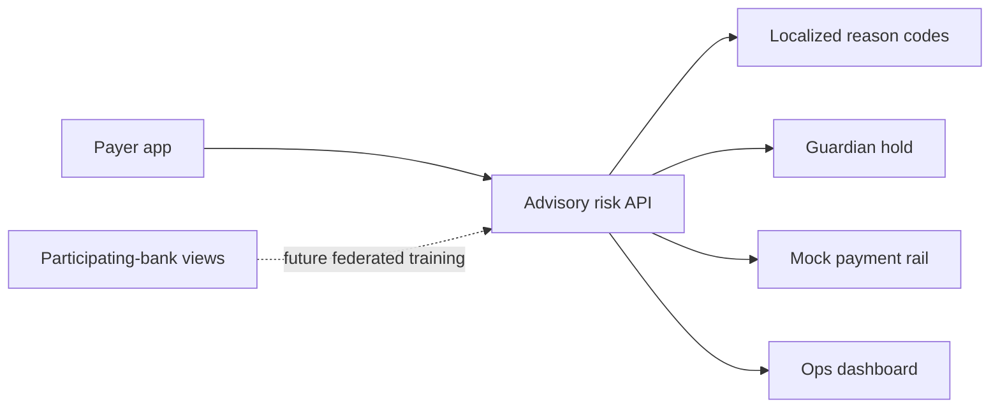

# SETU-Shield

**A privacy-preserving safety net for every simulated UPI payment.**

SETU-Shield is a hackathon demonstrator for an advisory fraud-safety layer: it scores a payee before money moves, gives the person a short plain-language explanation in English, Hindi, Tamil, or Telugu, and can ask an enrolled guardian to approve a risky payment. The repository uses synthetic data only. It does not connect to NPCI, a bank, or real customer accounts.

## What the demo proves

Asha receives a simulated ₹24,500 collect request from a collector mule. The scorer recognizes the unsafe mix of a collect request, a large first-time payment, and a flagged payee; the payment is held, Arun gets a signed single-use link, and the operations console receives an alert.



## Quick start

```powershell
make setup
make data eval
make api
```

In separate terminals, run `npm install; npm run dev` in `apps/payer-app` and `apps/ops-dashboard`. Open `http://localhost:5173` for the payer experience and `http://localhost:5174` for operations.

`make demo` runs the synthetic data and evaluation steps, then starts the API. Docker Compose can run the same three services with `docker compose up`.

## Evaluation status

`make eval` produces `results/metrics.json` from a small deterministic smoke evaluation of the local risk policy. It intentionally reports federated, isolated, centralized, fairness, privacy-utility, and poisoning measurements as **not measured**. Those numbers must not be claimed until the full simulator and three-arm training experiment are implemented and run.

## Design choices

- Fail open: an unavailable advisory scorer never prevents payment processing.
- Keep intervention calm: users see at most two behavioural reasons, not a claim that someone is a fraudster.
- Guardian links are HMAC-signed, short-lived, and single-use. Sensitive payment data stays out of the URL.
- The local demo rail is deterministic and offline. It is an adapter seam, not an NPCI integration.

See [architecture](docs/architecture.md), [API guide](docs/api.md), [privacy and threat model](docs/privacy-and-threat-model.md), and the [model decision](docs/decisions/0001-model-choice.md).

## Limitations

This is a demonstrator, not a production fraud system. Its current risk policy is deterministic and its data is simulated. The full federated-learning benchmark, formal secure aggregation, differential-privacy accounting, production authentication, native-speaker translation review, fairness study, and RBI/NPCI compliance review remain future work.

## Team and licence

`{{TEAM_NAME}}` · `{{MEMBERS}}` · `{{COLLEGE}}`

Released under the [MIT License](LICENSE).

