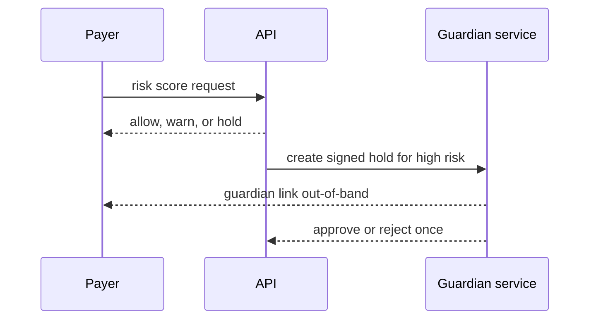

# Architecture

SETU-Shield is an advisory service. A payment client submits only the pending-payment fields needed for a risk check. The API applies a local demo policy, maps the result to at most two plain-language reasons, and either permits the mock rail, warns the payer, or creates a guardian hold.

The present local implementation measures only in-process policy latency through `make eval`; it has no Redis or ONNX dependency yet. The 150 ms payment-time target is a future acceptance threshold, not a published result. If the scorer is marked unavailable, the API returns `allow` with `degraded: true`, emits an audit entry, and leaves payment processing uninterrupted.

