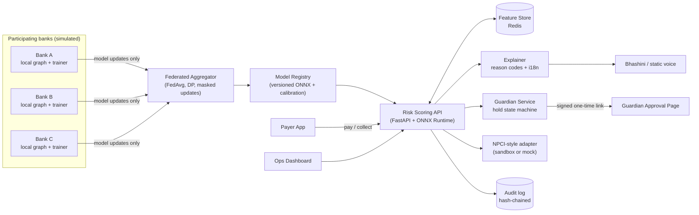
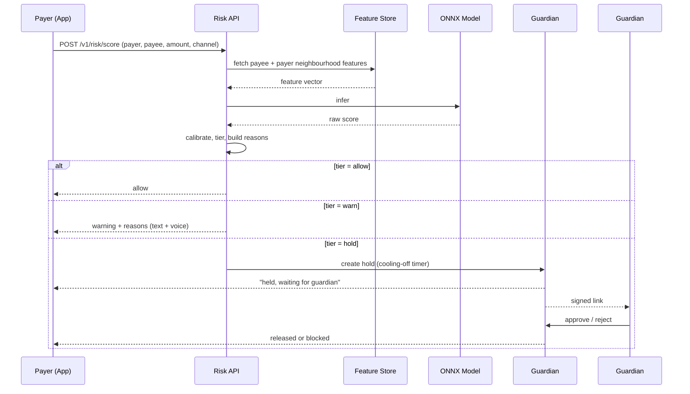

# SETU-Shield — Master Build Specification

> **Hand this single file to your coding agent.** It contains everything needed to produce the full repository, the written deliverables, and the pitch deck in one pass. Read Section 0 first; it governs how the rest is executed.

---

## 0. Agent Operating Instructions (READ FIRST)

**Role.** You are a senior engineering team (ML engineer, backend engineer, frontend engineer, technical writer) shipping a national-level fintech hackathon submission. Output must look like it was built by a careful, experienced team, not generated in bulk.

**Ground rules**

1. **Build everything in this document.** Do not skip sections, stub features with `TODO`, or leave placeholder text. If something is impossible in the environment (e.g., no NPCI sandbox credentials), implement the adapter interface with a faithful mock and document it clearly.
2. **Never invent numbers.** Every metric, latency figure, or accuracy claim in the README, proposal, or deck must come from `results/metrics.json`, produced by `make eval`. Deliverables are rendered from that file (see Section 11). If a value is missing, run the experiment; do not estimate.
3. **Be honest about synthetic data.** The dataset is simulated. State this plainly in README, deck, and proposal. Do not claim NPCI, Citi, or any bank endorsed, integrated, or validated this. Say "designed to plug into NPCI-style APIs" rather than "integrated with NPCI".
4. **Everything runs with one command.** `make demo` must bring up the full stack (data → trained models → API → apps → dashboard) on a laptop with Docker, no GPU required.
5. **Quality bar.** Typed Python (mypy-clean on `src`), `ruff` + `black`, pytest with ≥70% coverage on core modules, TypeScript strict mode, ESLint clean, pre-commit hooks, CI green.
6. **Human voice.** Follow Section 12 for all prose (README, docs, proposal, deck, commit messages).
7. **Commit as you go.** Use Conventional Commits (`feat:`, `fix:`, `docs:`, `test:`, `chore:`), small logical commits, about 40–80 total. Final tag `v1.0.0`.
8. **Work in the order of Section 10** and verify each milestone's acceptance criteria before moving on.

**Placeholders to substitute before publishing** (search the repo for `{{`):

| Token | Meaning |
|---|---|
| `{{TEAM_NAME}}` | Team name |
| `{{MEMBERS}}` | Names + roles |
| `{{GITHUB_URL}}` | Public repo URL |
| `{{DECK_URL}}` | Public link to the deck PDF |
| `{{DEMO_VIDEO_URL}}` | Optional demo video link |
| `{{COLLEGE}}` | Institution |

---

## 1. Project Brief

**Name:** SETU-Shield ("setu" = bridge)
**Tagline:** *A privacy-preserving safety net for every UPI payment.*
**Primary hackathon track:** Real-Time Payments. **Secondary:** Financial Inclusion.

**One-line pitch.** Banks can each see only their own slice of a fraud ring, so mule accounts slip through; SETU-Shield lets banks train one shared fraud model without sharing customer data, scores the payee in under 150 ms before money moves, and, for vulnerable users, asks a trusted family member to co-approve risky payments in the user's own language.

### 1.1 The problem, stated precisely

- UPI fraud increasingly involves the victim *authorising* the payment after being manipulated (fake collect requests, QR swaps, impersonation, "digital arrest" calls). Credential theft is no longer the main story.
- Stolen funds are quickly moved through **mule accounts** across multiple banks in minutes. Each bank sees only the hop touching its own customers.
- Banks cannot pool raw transaction data (customer privacy, RBI guidelines, DPDP Act 2023).
- Existing warnings are generic ("Are you sure?") and ignored; elderly and first-time digital users have no human safety net.

### 1.2 The solution in three layers

1. **Federated Mule-Graph Engine.** Each bank trains locally on its own partial transaction graph. Only model updates are shared, aggregated with FedAvg (plus optional differential privacy). The global model learns cross-bank ring patterns no single bank can see.
2. **Real-Time Payee Risk Score.** Before a payment completes, the payee VPA is scored in a p95 target of under 150 ms, and the response includes plain-language **reason codes**.
3. **Guardian Co-Approval + Vernacular Voice.** High-risk payments from opted-in users are placed on a short cooling-off hold; a trusted contact approves or rejects through a signed one-time link. Warnings are delivered as text and voice in English, Hindi, Tamil, Telugu.

### 1.3 What makes it novel (say this in the deck)

- Federated **graph** learning applied to *cross-bank mule detection*, evaluated against isolated-bank and centralized baselines on ring-structured synthetic data.
- Explanations designed for humans at the moment of payment, not analysts after the fact.
- A **social** control (guardian) paired with the **technical** control (risk score).
- Designed as an *advisory signal* that sits alongside existing bank fraud systems, so it doesn't require replacing them.

---

## 2. Repository Layout

Create exactly this structure:

```
setu-shield/
├── README.md
├── LICENSE                      # MIT
├── SECURITY.md
├── CONTRIBUTING.md
├── Makefile
├── docker-compose.yml
├── .env.example
├── .pre-commit-config.yaml
├── .github/workflows/ci.yml
├── pyproject.toml
├── docs/
│   ├── architecture.md
│   ├── api.md
│   ├── evaluation.md
│   ├── privacy-and-threat-model.md
│   ├── decisions/               # short ADRs (0001-...md)
│   ├── roadmap.md
│   ├── judge-qna.md
│   ├── proposal.md              # final submission text, rendered from template
│   └── pitch/
│       ├── deck.md              # Marp source
│       ├── deck.pdf             # exported
│       ├── deck.pptx            # exported
│       └── assets/              # diagrams, charts (generated)
├── src/setu/
│   ├── __init__.py
│   ├── config.py
│   ├── simulator/               # synthetic multi-bank UPI world
│   ├── features/                # feature engineering + neighbourhood aggregation
│   ├── models/                  # SageLite, baselines, calibration
│   ├── federated/               # Flower server/clients, DP, secure-agg simulation
│   ├── serving/                 # FastAPI app, ONNX runtime, Redis feature store
│   ├── explain/                 # reason codes, templates, i18n
│   ├── guardian/                # hold state machine, signed tokens
│   ├── adapters/                # npci_sandbox (real + mock), bhashini (real + static)
│   └── audit/                   # hash-chained audit log
├── scripts/
│   ├── generate_data.py
│   ├── train_isolated.py
│   ├── train_federated.py
│   ├── train_centralized.py
│   ├── export_onnx.py
│   ├── run_eval.py              # writes results/metrics.json + charts
│   ├── render_docs.py           # fills {{METRICS.*}} tokens in docs/deck
│   └── simulate_attack.py       # live demo driver
├── apps/
│   ├── payer-app/               # Vite + React + TS + Tailwind (mobile-first)
│   └── ops-dashboard/           # Vite + React + TS + Cytoscape + Recharts
├── results/                     # metrics.json, charts, model cards (git-tracked)
├── tests/
│   ├── unit/
│   ├── integration/
│   └── load/                    # locust or k6 script for latency
└── data/                        # generated, gitignored (except tiny sample)
```

---

## 3. System Architecture



### 3.1 Payment-time sequence



---

## 4. Module Specifications

### 4.1 Simulator (`src/setu/simulator`)

Generates a reproducible synthetic UPI world. Seeded (`--seed 42`). Defaults: 3 banks × 20,000 accounts, 30 simulated days, ≈600k transactions. All sizes configurable in `config.py`.

**Entities:** account (id, bank, VPA, age_days, kyc_tier, user_segment ∈ {salaried, merchant, student, senior, first_time_user}, city_tier, is_mule flag).

**Legitimate behaviours** (must dominate volume):
- Salary credits, rent, EMI, utility and bill payments
- Merchant payments (kirana, food, transport), with realistic small-ticket skew (log-normal amounts)
- Family P2P transfers with stable counterparties
- Daily/weekly rhythm (peak hours, month-start salary bump, festival spikes)

**Fraud typologies** (inject about 1.5% mule accounts, at least 6 distinct patterns, with rings that **span banks**, roughly 35% of edges cross-bank):
1. **Collector fan-in:** many unrelated victims → one mule within a short window.
2. **Layering chain:** A→B→C→D within minutes, each hop skimming 1–3%.
3. **Fan-out cash-out:** mule → many small VPAs / merchant-like sinks.
4. **Round-tripping cycle:** funds circle among 3–5 accounts.
5. **New-account burst:** account age < 7 days with abnormal velocity.
6. **Victim-authorised scam payment:** first-time payee, amount ≫ payer's history, unusual hour, collect-request channel.

**Ground truth outputs:** node labels (mule / not), edge labels (fraudulent transfer / not), ring IDs, victim events with timestamps.

**Bank views (critical for the federation story).** Each bank receives only edges where **at least one endpoint is its own customer**. Foreign endpoints appear as opaque hashed stubs with edge-level info only (amount, time, channel). No bank holds the full graph. Persist as `data/bank_{a,b,c}/` and a hidden `data/global/` used *only* for the centralized upper-bound baseline and evaluation.

**Splits:** time-based (first 21 days train, next 4 validation, last 5 test) **and** a held-out-rings test set (rings never seen in training), reported separately.

### 4.2 Features (`src/setu/features`)

Per-node features, computed in rolling windows (1h / 24h / 7d):
- Degree: in/out, unique counterparties, new-counterparty ratio
- Volume: sum in/out, mean/max amount, amount entropy, round-amount ratio
- Timing: night-hour ratio, median **pass-through delay** (credit → debit), burst score
- Account: age_days, kyc_tier, segment one-hot
- Flow: in/out ratio, retention ratio (how much stays), cross-bank counterparty ratio

**Neighbourhood aggregation ("SageLite input").** For each node build a fixed-size vector: `[self | mean(1-hop in-neighbours) | mean(1-hop out-neighbours) | mean(2-hop)]`, all computed from features visible to that bank. This is what makes the model *graph-aware* and also *ONNX-servable* without dynamic graph ops.

### 4.3 Models (`src/setu/models`)

Be deliberate here and write ADR `0001-model-choice.md`:

- **SageLite (primary, served).** Pure PyTorch MLP over the aggregated neighbourhood vector (2 hidden layers, 64→32, dropout, LayerNorm). Chosen because it exports cleanly to ONNX, runs in milliseconds on CPU, and federates trivially.
- **GraphSAGE-PyG (research comparison, optional).** 2-layer GraphSAGE via PyTorch Geometric, offline only, to show how much the SageLite approximation gives up. If PyG install fails, skip gracefully and document.
- **XGBoost baseline.** Tabular-only (self features, no neighbourhood), to demonstrate the value of graph context.

**Training:** weighted BCE or focal loss for class imbalance; AdamW; early stopping on validation PR-AUC. **Calibration:** isotonic regression on validation; store calibrator alongside the model.

**Metrics (report all):** PR-AUC (headline), ROC-AUC, recall at 1% FPR, precision@top-k, F1 at chosen threshold, confusion matrix, and **ring-level detection rate** (fraction of injected rings where at least one member is flagged before the ring completes cash-out).

### 4.4 Federation (`src/setu/federated`)

- **Flower** (`flwr`), one server process, three client processes (containers), FedAvg weighted by local sample count, 10–20 rounds, configurable local epochs.
- **Differential privacy (optional flag):** per-client update clipping + Gaussian noise; report ε via Opacus accountant; produce a **privacy–utility table** (ε ∈ {∞, 8, 4, 2}).
- **Secure aggregation:** implement a *simulated* pairwise-masking scheme (masks cancel on sum) to demonstrate the concept. Label it clearly as simulated in code and docs; do not claim production-grade secure aggregation.
- **Three comparison arms, identical architecture and data budget:**
  1. *Isolated* (each bank alone, evaluated on the global test set)
  2. *Federated* (FedAvg)
  3. *Centralized* (upper bound, all data pooled)
- **The headline chart:** PR-AUC and ring-level detection for Isolated vs Federated vs Centralized, on both the time-split test and the held-out-rings test. Also export the per-round convergence curve.

Report whatever the experiment shows. If federated does not beat isolated on some metric, say so in `evaluation.md` and explain why.

### 4.5 Serving (`src/setu/serving`)

FastAPI (async), ONNX Runtime CPU, Redis feature store, Uvicorn workers.

**Latency budget** (document in `architecture.md`, measure in `tests/load`): feature fetch ≤ 40 ms, inference ≤ 20 ms, explanation ≤ 20 ms, overhead ≤ 20 ms. Target **p95 < 150 ms** at a stated throughput on a laptop; report the real numbers.

**Endpoints**

| Method | Path | Purpose |
|---|---|---|
| POST | `/v1/risk/score` | Score a pending payment |
| POST | `/v1/payments` | Mock payment initiation (calls scoring, then NPCI adapter) |
| POST | `/v1/guardian/enroll` | Register a payer ↔ guardian pair |
| GET | `/v1/holds/{id}` | Hold status |
| POST | `/v1/holds/{id}/decision` | Guardian approve/reject (signed token required) |
| GET | `/v1/ops/graph` | Subgraph for dashboard |
| GET | `/v1/ops/alerts` | Recent alerts stream (also WebSocket `/ws/alerts`) |
| GET | `/v1/model/info` | Version, training metadata, metrics |
| GET | `/healthz`, `/readyz` | Probes |

**Score request/response (Pydantic v2 models, validate strictly)**

```jsonc
// POST /v1/risk/score
{
  "payer_vpa": "asha@bankA",
  "payee_vpa": "quickcash77@bankC",
  "amount_inr": 24500.00,
  "channel": "collect",          // pay | collect | qr
  "timestamp": "2026-10-03T22:41:10+05:30",
  "lang": "ta"                    // en | hi | ta | te
}
// 200 OK
{
  "risk_score": 0.87,
  "tier": "hold",                 // allow | warn | hold
  "reasons": [
    {"code": "FAN_IN_BURST", "weight": 0.41,
     "text": "This account received money from 40 new people in the last 2 hours.",
     "text_localized": "…", "audio_url": "/v1/tts/abc123.mp3"}
  ],
  "guardian_required": true,
  "hold_id": "h_9f2c…",
  "model_version": "fed-r12-2026-10-02",
  "latency_ms": 96
}
```

**Tiering (config-driven, calibrated):** `allow < 0.35 ≤ warn < 0.70 ≤ hold`. Choose thresholds from the validation set to hit a stated false-positive budget; document how. For users **not** enrolled with a guardian, `hold` degrades to a strong warning plus a 60-second delay with a "cancel payment" button.

**Failure behaviour.** If the scorer, Redis, or model is unavailable, the API returns `tier: "allow"` with `degraded: true` and logs an alert. It is advisory and must never block payments on its own outage. Document this decision in an ADR.

### 4.6 Explainability (`src/setu/explain`)

Map model attributions (gradient×input or SHAP on the MLP) to a small, curated set of **reason codes**. Codes and templates (English, with `{n}`, `{h}` placeholders):

| Code | Template |
|---|---|
| `FAN_IN_BURST` | "This account received money from {n} new people in the last {h} hours." |
| `FAST_PASS_THROUGH` | "Money sent here tends to be moved out within minutes." |
| `NEW_ACCOUNT_HIGH_VELOCITY` | "This account is only {d} days old but is handling a lot of payments." |
| `FIRST_TIME_PAYEE_LARGE` | "You've never paid this person, and this amount is much larger than your usual." |
| `UNSOLICITED_COLLECT` | "This is a request to collect money. Real payments to you never need approval like this." |
| `LINKED_TO_FLAGGED` | "This account is closely linked to accounts already reported for suspicious activity." |

Show at most the top 2 reasons. Never expose raw scores as "fraud probability" to end users. Use calm language and a clear action ("Pause and check").

**Localization.** Provide static translations for `en`, `hi`, `ta`, `te` for every template. Sample (`FAN_IN_BURST`):

- hi: "इस खाते में पिछले {h} घंटों में {n} नए लोगों से पैसे आए हैं। भुगतान से पहले रुककर जाँच करें।"
- ta: "இந்தக் கணக்கிற்கு கடந்த {h} மணி நேரத்தில் {n} புதிய நபர்களிடமிருந்து பணம் வந்துள்ளது. பணம் செலுத்துவதற்கு முன் நிறுத்தி சரிபாருங்கள்."
- te: "ఈ ఖాతాకు గత {h} గంటల్లో {n} కొత్త వ్యక్తుల నుండి డబ్బు వచ్చింది. చెల్లించే ముందు ఒకసారి ఆగి తనిఖీ చేయండి."

Write natural translations for the remaining codes in the same style and flag them for native-speaker review in `docs/roadmap.md`.

**Voice.** `BhashiniProvider` (env `BHASHINI_USER_ID`, `BHASHINI_API_KEY`) for translation/TTS when keys exist; `StaticProvider` (pre-rendered strings + browser `speechSynthesis` fallback in the app) otherwise. Same interface, selected by env.

### 4.7 Guardian (`src/setu/guardian`)

State machine: `CREATED → PENDING_GUARDIAN → (APPROVED | REJECTED | EXPIRED) → (RELEASED | CANCELLED)`.

- Cooling-off default 10 minutes (configurable); on expiry with no guardian response, the payment is **cancelled** (safe default), and the payer may retry.
- Guardian link: HMAC-signed, single-use, expires with the hold; contains only hold ID and a nonce, with no amount or payee in the URL. The page shows amount, payee, and the top reason.
- Payer can always cancel their own hold.
- Rate limit hold creation per payer; prevent guardian-link brute force.
- Every transition writes an audit event.

### 4.8 Audit log (`src/setu/audit`)

Append-only JSONL/SQLite table where each entry includes the SHA-256 of the previous entry (hash chain). Provide `verify_chain()` and a test that detects tampering. Log decisions, tier, model version, reason codes, and hold transitions. **Never log full VPAs or amounts in plaintext outside the audit store; hash identifiers in application logs.**

### 4.9 NPCI-style adapter (`src/setu/adapters/npci_sandbox`)

Define an abstract `PaymentRail` interface: `validate_vpa()`, `initiate_pay()`, `initiate_collect()`, `get_status()`. Implement:
- `SandboxRail` — calls the hackathon sandbox using env-supplied base URL/credentials (implement to the documented spec if provided; otherwise leave the HTTP layer isolated and tested against recorded fixtures).
- `MockRail` — deterministic in-memory rail used by default in `make demo`.

Contract tests must pass against both.

### 4.10 Payer App (`apps/payer-app`)

Vite + React + TypeScript (strict) + Tailwind. Mobile-first (390px), accessible (WCAG AA contrast, focus states, `aria-live` for warnings, large tap targets), language switcher (EN/HI/TA/TE).

Screens: Home (balance mock, recent payees) → Pay/Collect → **Risk Sheet** (calm, non-alarmist bottom sheet: top reasons, "Pause and check", "Pay anyway" only for `warn`, voice-play button) → **Hold screen** (countdown, "waiting for {guardian}", cancel) → Result. Plus a **Guardian page** (`/g/:token`) with approve/reject.

Design language: a single deep-teal accent, generous whitespace, neutral grays, red only for `hold`, amber for `warn`. No stock illustrations or neon gradients; use simple SVG icons.

### 4.11 Ops Dashboard (`apps/ops-dashboard`)

For a bank fraud-ops analyst. Panels:
1. **Live alert feed** (WebSocket) with tier badges and reason codes
2. **Interactive graph** (Cytoscape): click an alert to see the payee's 2-hop neighbourhood, colour by risk, highlight the ring
3. **Federation panel:** per-round convergence, per-bank contribution, model version history
4. **Model card:** metrics from `results/metrics.json`, calibration curve, threshold explorer (drag threshold, see precision/recall/FP rate update)
5. **Privacy panel:** ε (if DP on), what leaves each bank (bytes of updates) vs. what stays
6. **"Run scam simulation" button** that triggers `scripts/simulate_attack.py` for the live demo

### 4.12 Security & Privacy

Write `docs/privacy-and-threat-model.md` covering: data-flow diagram; what each party can see; **STRIDE** table; threats specific to federated learning (model inversion, membership inference, poisoned updates / malicious client) and the mitigations implemented (update clipping, norm-based outlier rejection, DP option) and not implemented (state honestly); DPDP Act alignment notes (purpose limitation, data minimisation); adversarial adaptation (mules changing behaviour) and retraining cadence. Include one small **poisoned-client experiment** (one bank submits scaled/flipped updates; show the norm filter's effect) in `evaluation.md`.

---

## 5. Infrastructure

- `docker-compose.yml`: `redis`, `postgres` (or SQLite fallback), `fl-server`, `fl-client-a/b/c`, `api`, `payer-app`, `ops-dashboard`. Health checks and `depends_on` conditions.
- `Makefile` targets: `setup`, `data`, `train-isolated`, `train-fed`, `train-central`, `export`, `eval`, `docs`, `test`, `lint`, `load-test`, `demo`, `clean`.
- `make demo` = data (if absent) → train (fast profile: fewer rounds/epochs) → export → docker compose up → seed Redis → open browser URLs printed to terminal.
- Provide both a **fast profile** (under 10 minutes total, for judges) and a **full profile** (for reported metrics).
- CI (`.github/workflows/ci.yml`): lint, type-check, unit + integration tests, build frontends, build Docker images. Badge in README.
- `.env.example` with every variable documented; no secrets in the repo.

---

## 6. Testing Requirements

- **Unit:** simulator determinism (same seed → same data), feature windows, calibrator monotonicity, reason-code mapping, hold state machine (all transitions and illegal ones), token signing/expiry/replay, audit chain tamper detection, FedAvg weighting correctness, secure-agg mask cancellation.
- **Integration:** end-to-end payment (allow / warn / hold / guardian approve / reject / expire), degraded mode when Redis is down, both `PaymentRail` implementations.
- **Load:** `tests/load` (Locust or k6) reporting p50/p95/p99 at a stated concurrency; write results into `results/metrics.json`.
- **Frontend:** component tests for Risk Sheet and Hold screen; one Playwright happy-path for the scam-interception flow.

---

## 7. Evaluation Protocol (`docs/evaluation.md`)

Explain the setup so a skeptical reviewer could reproduce it: dataset construction, bank views, splits, arms, hyperparameters, seeds (run **≥3 seeds**, report mean ± std), metrics, threshold selection, the privacy–utility table, the poisoned-client experiment, latency results, and a **Limitations** section (synthetic data; simplified typologies; simulated secure aggregation; no real NPCI traffic; concept drift; fairness across user segments untested beyond a basic per-segment breakdown that you should include).

Include a **per-segment false-positive table** (salaried, merchant, student, senior, first-time) because financial-inclusion claims need it.

`results/metrics.json` schema (top-level keys): `dataset`, `arms.{isolated,federated,centralized}`, `xgboost_baseline`, `privacy_utility`, `poisoning`, `latency`, `per_segment_fpr`, `thresholds`, `model_version`, `seeds`, `generated_at`.

---

## 8. Written Deliverables

### 8.1 `docs/proposal.md` (final submission text)

Render this from the template below, replacing `{{METRICS.*}}` from `results/metrics.json` via `scripts/render_docs.py`. Keep each section tight; judges skim.

**Proposal Title**
SETU-Shield: Federated Graph Intelligence for Real-Time Mule-Account Interception and Guardian-Assisted Payments in UPI

**Problem Understanding**
> Most UPI fraud today doesn't involve a hacked account. Someone is talked into sending the money themselves, and within minutes it's moving through a chain of mule accounts spread across several banks. Each bank sees one hop of that chain. None can see the ring, and none can share customer data to build the full picture. Meanwhile, the people most at risk (elderly users, first-time digital users) get the same generic "Are you sure?" popup as everyone else, and they tap through it.
>
> The gap is twofold: there is no privacy-preserving way for banks to learn from each other's fraud patterns, and there is no meaningful, human-centred intervention at the moment of payment.

**Solution Description**
> SETU-Shield adds three things around a UPI payment. First, banks train one shared mule-detection model using federated learning, so only model updates travel, never customer data. Second, at payment time the payee is scored in {{METRICS.latency.p95_ms}} ms (p95) and the user sees a plain-language reason in their own language, such as "this account received money from 40 new people in two hours". Third, for users who opt in, a risky payment is held briefly and a trusted family member gets a one-time link to approve or reject it.
>
> It is designed as an advisory layer that sits beside existing bank fraud systems. If it goes down, payments continue.

**Implementation Approach**
> We built a seeded simulator of three banks with partial views of one transaction graph, with six fraud typologies including cross-bank rings. A neighbourhood-aware model (SageLite) is trained three ways — isolated, federated (Flower, FedAvg, optional differential privacy) and centralised as an upper bound — and evaluated on a time-split and on rings it has never seen. The winning model is exported to ONNX and served through FastAPI with a Redis feature store. Reason codes are mapped from attributions and localised into English, Hindi, Tamil and Telugu. The guardian flow is a signed, single-use, expiring approval link with a hash-chained audit log. Payments go through an adapter designed for NPCI-style sandbox APIs, with a mock rail for offline demos.

**Technology Stack**
> Python 3.11, PyTorch, XGBoost (baseline), Flower, Opacus, ONNX Runtime, FastAPI, Redis, PostgreSQL, React + TypeScript + Tailwind, Cytoscape.js, Recharts, Docker Compose, GitHub Actions, Locust, Bhashini (translation/TTS, with static fallback).

**Expected Impact**
> On our synthetic benchmark, the federated model reached PR-AUC {{METRICS.arms.federated.pr_auc}} against {{METRICS.arms.isolated.pr_auc}} for banks working alone, and detected {{METRICS.arms.federated.ring_detection_pct}}% of injected fraud rings before cash-out (isolated: {{METRICS.arms.isolated.ring_detection_pct}}%). We are clear that this is simulated data; the point is the mechanism, not the absolute numbers. For banks, it means earlier mule detection without sharing raw data. For users, it means warnings they can understand and, if they want it, a family member as a second pair of eyes. For inclusion, it means first-time and elderly users can adopt digital payments with a safety net.

**GitHub Repository URL:** `{{GITHUB_URL}}`
**Pitch Deck URL:** `{{DECK_URL}}`

*(Rule: if a metric turns out unimpressive, keep the sentence structure but report the true value and add one honest line about why. Do not edit numbers.)*

### 8.2 `README.md`

Structure: title + badges → one-paragraph pitch → **demo GIF/screenshot row** (capture from the running apps) → the problem in 5 lines → how it works (architecture diagram) → **results table** (rendered from metrics.json) → quick start (`make demo`, 3 commands max) → repo tour → design decisions (link ADRs) → honest limitations → roadmap → security & privacy note → team → license. Keep it under ~250 lines.

### 8.3 Other docs

`architecture.md` (diagrams, latency budget, failure modes), `api.md` (from OpenAPI plus worked curl examples), `roadmap.md` (pilot path: shadow mode with a real bank, more typologies, on-device scoring, formal secure aggregation, native-speaker review of translations, fairness audit, RBI/NPCI compliance review), `judge-qna.md` (Section 9 answers, expanded), `SECURITY.md` (responsible disclosure), `CONTRIBUTING.md` (short).

---

## 9. Pitch Deck (`docs/pitch/deck.md`, Marp → PDF + PPTX)

**Format:** 16:9, Marp with a custom theme (`theme.css`): Inter/system sans, deep teal `#0F5C63` accent, near-black text `#111827`, light gray backgrounds, red `#B42318` / amber `#B54708` used only for risk. Max ~35 words per slide. One idea per slide. Every chart generated from `metrics.json` (matplotlib, consistent styling, labelled axes, no chartjunk). Include speaker notes (`<!-- notes -->`) written as natural spoken language, ~60–90 seconds per slide. Export: `npx @marp-team/marp-cli deck.md --pdf --pptx`.

**Slide plan (12 main + 3 appendix; target 7-minute pitch)**

| # | Title (on-slide) | Content / visual | Speaker-note intent |
|---|---|---|---|
| 1 | SETU-Shield | Name, tagline, team, college, track | Open with one sentence hook: *"Most UPI fraud victims press the pay button themselves."* |
| 2 | The money is gone in minutes | Simple timeline: victim → mule 1 → mule 2 → cash-out, minutes labelled | Make the audience feel the speed |
| 3 | Every bank sees one hop | Three colour-coded bank views of the same chain, each showing a fragment | The core insight: no one has the whole picture |
| 4 | And the user gets a popup they ignore | Screenshot of a generic warning vs. our reason-based warning | The human side |
| 5 | Our idea | Three-layer graphic: Federate → Score → Guardian | Plain-language explanation, no jargon |
| 6 | How the federation works | Diagram: data stays in banks, only updates travel | Address privacy immediately |
| 7 | Live demo | Screenshot strip; *(presenter switches to live app)* | The scripted 90-second demo (Section 9.1) |
| 8 | Does it actually work? | Headline chart: Isolated vs Federated vs Centralized, PR-AUC + ring detection | Quote real numbers; admit synthetic data in the same breath |
| 9 | Fast enough for UPI | Latency histogram, p50/p95/p99 vs 150 ms budget | Advisory design, fail-open |
| 10 | Built for people, not just banks | Guardian flow + 4-language screenshots + per-segment FPR | Financial inclusion angle |
| 11 | What we won't pretend | Limitations and threat model in 4 bullets (synthetic data, simulated secure-agg, drift, poisoning + what we tested) | Builds credibility with judges |
| 12 | Where this goes | Pilot path: shadow mode → one bank → NPCI-style advisory signal; the ask (mentorship, sandbox access, pilot intro) | End with a concrete ask |
| A1 | Architecture | Full diagram | Backup |
| A2 | Privacy–utility table + poisoning experiment | Backup | |
| A3 | Team & tech stack | Backup | |

### 9.1 Live demo script (90 seconds; also implement as `scripts/simulate_attack.py`)

1. Ops dashboard is open, quiet. Click **Run scam simulation**.
2. A collector mule (Bank C) starts receiving payments from many new senders; the graph lights up a ring across Banks A/B/C.
3. In the Payer App, "Asha" (senior, Tamil, guardian = her son) receives a collect request from that mule for ₹24,500.
4. The Risk Sheet appears in **Tamil**, with voice. Reason: fan-in burst. Tier: hold.
5. Cut to the guardian page on a second device or tab; the son sees amount, payee, and reason; taps **Reject**.
6. Payer App shows "Payment cancelled — thanks for checking." Dashboard shows the alert and audit entry; the ring is highlighted.
7. Close on the federation panel: *"Bank A alone would have missed this ring; the federated model caught it."* (Only say this if the evaluation supports it; the demo scenario must be chosen from a ring where federated detected and isolated missed. Assert this in the script and fail loudly if no such ring exists.)

### 9.2 Judge Q&A prep (`docs/judge-qna.md`, expand each into 3–5 sentences, honest tone)

- *Synthetic data isn't real.* → Correct; we built the pipeline to be data-agnostic, and here's exactly what a shadow-mode pilot would validate.
- *Latency at UPI scale?* → Numbers from load test; advisory + fail-open; precomputed neighbourhood features; horizontal scaling story.
- *False positives hurt UX.* → Tiered response, calibrated thresholds, per-segment FPR table, only a hold for opted-in users.
- *Why federated and not just share data?* → Regulation, trust, and competitive concerns; show the centralised arm as the ceiling and what fraction federation recovers.
- *Can fraudsters adapt?* → Yes; retraining cadence, drift monitoring, and reason codes based on behaviour rather than static lists.
- *What if a bank sends poisoned updates?* → Clipping + norm filtering; here's the experiment; here's what it doesn't cover.
- *Is the guardian flow a new attack surface?* → Signed single-use tokens, no sensitive data in URL, expiry, rate limits, fail-safe cancel; social-engineering the guardian is a residual risk we list.
- *How does this differ from what banks already do?* → Banks run in-house rules/ML on their own data; we add cross-bank learning and pre-payment human-readable intervention. We don't claim to replace it.
- *Why not rely on NPCI-level central detection?* → A central view is powerful but needs data centralisation; federation is a complementary, privacy-preserving option, and our model is designed to plug into such a layer.

---

## 10. Build Order & Acceptance Criteria (48-hour plan)

| Phase | Hours | Deliver | Acceptance check |
|---|---|---|---|
| 1. Scaffolding | 0–3 | Repo layout, tooling, CI skeleton, Docker base | `make lint test` passes on empty modules |
| 2. Simulator | 3–9 | 3-bank world with 6 typologies, bank views, splits | Deterministic by seed; ring count and cross-bank edge % logged; unit tests green |
| 3. Features + models | 9–16 | Feature pipeline, SageLite, XGBoost baseline, calibration | Beats a random baseline; PR-AUC reported; ADR 0001 written |
| 4. Federation | 16–24 | Flower server/clients, DP flag, secure-agg sim, 3 arms | `make eval` produces `metrics.json` with all arms and ≥3 seeds |
| 5. Serving | 24–30 | ONNX export, FastAPI, Redis, reasons, tiers, audit | Score endpoint works; load test p95 measured; degraded mode tested |
| 6. Guardian + i18n | 30–34 | State machine, signed links, translations, voice | All state-machine tests pass; 4 languages render |
| 7. Frontends | 34–41 | Payer App, guardian page, Ops dashboard | Full scam-interception flow works via UI; Playwright happy-path green |
| 8. Docs + deck | 41–46 | README, docs, proposal render, deck export | No `{{METRICS` tokens remain; PDF + PPTX exist; numbers match `metrics.json` |
| 9. Polish | 46–48 | Fresh-clone test, screenshots/GIF, tag `v1.0.0` | New clone → `make demo` works in under 15 min on a clean machine |

---

## 11. Metrics → Docs Rendering (`scripts/render_docs.py`)

- Reads `results/metrics.json`.
- Replaces every `{{METRICS.path.to.value}}` token in `docs/proposal.md`, `README.md`, `docs/pitch/deck.md`, and `docs/evaluation.md`.
- Fails (non-zero exit) if any token can't be resolved or any `{{` remains in final artifacts (excluding the placeholder table in Section 0, which the human fills).
- Regenerates charts into `docs/pitch/assets/` with consistent styling.
- CI step: `make docs` and grep for unresolved tokens.

---

## 12. Writing Style (applies to every piece of prose)

The deliverables should read like a sharp, slightly opinionated student team wrote them, not like a template.

**Do**
- Lead with the concrete: a number, a scenario, a name ("Asha", ₹24,500, 40 senders in 2 hours).
- Vary sentence length. Short sentences for impact; longer ones for reasoning.
- Say what you *chose not to do* and why. Trade-offs make writing credible.
- Use plain words: "use" not "leverage", "help" not "facilitate", "show" not "showcase".
- Own limitations in the same paragraph as the claim.
- Write commit messages and ADRs in the first-person plural where natural ("We fail open because…").

**Don't**
- No stacked buzzwords ("AI-powered next-gen blockchain-enabled ecosystem").
- Avoid: *delve, tapestry, seamless, cutting-edge, revolutionize, game-changer, robust (as filler), holistic, unlock the power of, in today's fast-paced world, it's important to note*.
- No em-dash in every sentence; no triplet-of-adjectives habit; no "Not only X, but also Y" repetition.
- No emojis in docs or deck (fine in code comments only if genuinely useful, though preferably none).
- No unexplained acronyms on first use (spell out UPI, VPA, DPDP, DP, FedAvg once).
- No claims of endorsement, production readiness, or real-world results.

**Deck-specific:** headlines are statements, not topics ("Every bank sees one hop", not "Problem"). Ban walls of text; if a slide needs a paragraph, it needs a picture.

---

## 13. Final Publishing Checklist (agent completes; human confirms)

- [ ] `make demo` works from a fresh clone
- [ ] `make test lint` green; CI green on `main`
- [ ] `results/metrics.json` present; all docs rendered; no unresolved tokens
- [ ] README has real screenshots/GIF from the running app
- [ ] `docs/pitch/deck.pdf` and `deck.pptx` exported and visually checked (no overflow, charts legible)
- [ ] Demo scenario verified: federated catches a ring that isolated misses (assertion passes)
- [ ] No secrets, API keys, or real personal data in the repo or git history
- [ ] Licence, SECURITY.md present; repo description and topics set (`upi`, `fintech`, `federated-learning`, `fraud-detection`, `graph-ml`)
- [ ] Human fills `{{TEAM_NAME}}`, `{{MEMBERS}}`, `{{COLLEGE}}`, `{{GITHUB_URL}}`, `{{DECK_URL}}`, re-runs `make docs`
- [ ] Push:

```bash
git init && git add -A && git commit -m "feat: initial SETU-Shield release"
git branch -M main
git remote add origin {{GITHUB_URL}}.git
git push -u origin main
git tag v1.0.0 && git push origin v1.0.0
```

---

## 14. If Time Runs Short — Priority Cut Order

Keep, in this order: **(1)** simulator + federated vs isolated vs centralised result, **(2)** scoring API with reason codes, **(3)** payer app risk sheet + guardian flow, **(4)** ops dashboard graph, **(5)** deck + README + proposal. Cut first: PyG GraphSAGE comparison, Bhashini live integration (keep static), DP sweep, Playwright test, Telugu/Hindi voice. Never cut: honesty about synthetic data, the metrics-driven rendering, or the live-demo scenario.

*End of specification.*
